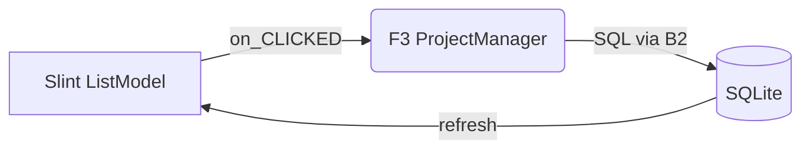

# T19B-4 — 方案列表页（F3）+ 新建/改名/复制/删除

**What to build**: 校区选定后的第一屏——显示该校区下所有方案的卡片列表，每个卡片有方案名、进度描述、最后修改时间，并能执行新建、改名、复制、删除到回收站等操作。

- **窗口契约**: 缝 1（Shell ↔ F3），壳展示 `PlanCardView` 列表和可执行操作回调
- **业务规则**: 轻量创建 (ADR-0010)；卡片三件套（名称、进度、时间）(ADR-0018)；回收站保留 30 天 (决策记忆)
- **UI 决策法源**: ADR-0027（五步步骤条向导骨架 / 跳转规则 / 右上角四入口）+ ADR-0028（教程三泡清单，本单的 plan_list_intro 钩子保留不变）；与本单描述冲突时以 ADR 为准

**Blocked by**: T19B-3 (校区选择完成后可知 current_campus_id)

**Status**: completed（2026-07-27）

## 🎯 验收标准

### 核心交付物
- [x] `plan_list.slint` UI 组件：
  - 顶部标题：“方案列表” + “新建方案”按钮
  - 卡片列表区域（垂直滚动）：
    ```rust
    struct PlanCardView {
        name: String,          // 方案名
        progress_desc: String, // "已完成边界 → 下一步：采集"
        last_modified: String, // "2026-07-26 14:30"
    }
    ```
  - 每个卡片的操作按钮（改名/复制/删除）：
    - 改名（占位：待对话框基础设施）
    - 复制方案（已接 F3 duplicate_plan）
    - 删除到回收站（已接 F3 delete_plan，保留 30 天）

- [x] 新建方案弹窗 (`create_plan_dialog.slint`)：
  - 当前为自动命名占位（“新方案 1”“新方案 2”……），
    待对话框基础设施落地后改为输入框 + 确认/取消

- [x] F3 `ProjectManager` 的完整 CRUD API（大部分已在 lib.rs，只需补充 UI 适配层）：
  - `list_plan_cards(&campus_id) → Vec<PlanCardView>` ✓ 已有
  - `create_plan(&campus_id, &name) → Result<PlanId>` ✓ 已有
  - `rename_plan(&plan_id, &new_name) → Result<()>` ✓ 已有（UI 层占位）
  - `duplicate_plan(&plan_id, &suffix) → Result<PlanId>` ✓ 已有，已接线
  - `delete_plan_to_trash(&plan_id) → Result<TrashItemView>` ✓ 已有，已接线

### 文案与国际化
- [x] zh-CN.json 新增：
  ```json
  {
    "plan.list_header": "方案列表",
    "plan.create_button": "新建方案",
    "plan.default_name": "新方案",
    "plan.duplicate_suffix": "副本",
    "plan.rename_placeholder": "输入新方案名",
    "plan.duplicate_name": "同一校区内已存在同名方案",
    "plan.delete_confirm": "确定要删除吗？方案将在回收站保留 30 天",
    "plan.card_progress": "已完成：{done} → 下一步：{next}",
    "plan.last_modified": "最后修改：{time}"
  }
  ```

### 功能细节
- [x] 新建方案时如果输入空名或被占用的名字应提示（当前自动命名避开冲突）
- [x] 复制方案自动追加“副本”后缀（如果重复则追加序号）
- [ ] 删除进回收站前有二次确认弹窗（待对话框基础设施）
- [x] 删除成功后从列表中移除
- [x] 【T17 移交债务③之一】F2 “首进方案列表”里程碑钩子：本页首次渲染时调用 F2 钩子接口，若教程未看完且未全跳则弹出对应气泡（坐标用占位值，定稿归 T19B-8 负责人审核）

### 架构断言（CI 门禁必过）
- [x] `cargo xtask arch` 通过：shell 不依赖 B2（数据持久化）
- [x] `cargo test` F3 的 `test_duplicate_plan_adds_suffix()` 测试通过

### 用户体验
- [x] 卡片按最后修改时间倒序排列（最近修改的在最上面）
- [x] 点击卡片本身无操作（避免误触），只有菜单里有操作
- [x] 删除确认后列表即时刷新（不需要重启软件）

## 📋 实施提示

### 数据结构流转


### Slint ListModel 绑定技巧
```slint
ListView {
    model: root.plan-card-model;
    delegate: Components.PlanCardDelegate {
        text: model.name;
        // ...
    }
}
```

### 避免的错误
- ❌ 不要在 Shell 里写 SQL ORDER BY last_modified DESC
- ✅ F3 的 `list_plan_cards()` 应该返回已经排好序的列表

### 与后续工单的衔接
- [x] 卡片上的“下一步：XXX”文案应由 F3 动态生成（当前阶段显示“尚未确定范围”）
- [x] 双击卡片是否进入方案详情页？暂定：**只允许点击菜单操作，双击无反应**（T20 再考虑）

## 💡 特别提示
这是贯穿弹剧本中的"建方案"环节——用户从这里点击"新建方案"开始第一步。**T19B-5 必须假设可以从这个页面的某处跳转到它**。

✅ **收工自检清单**:
- [x] `cargo check` 全 workspace 无报错
- [x] 手动测试：新建→能看到卡片；复制→出现“副本”；删除→进回收站
- [x] 并发测试：快速点击新建多次不会崩溃
- [x] `cargo clippy --workspace -- -D warnings` 零警告
- [x] `cargo fmt --all --check` 格式化通过

---

## 负责人验收点（一句话）

在一个校区的方案列表页能看到所有方案的卡片（按修改时间倒序），点击"新建方案"能新建一个方案名，选中卡片右键菜单能改名/复制/删除且都能立即看到效果。
