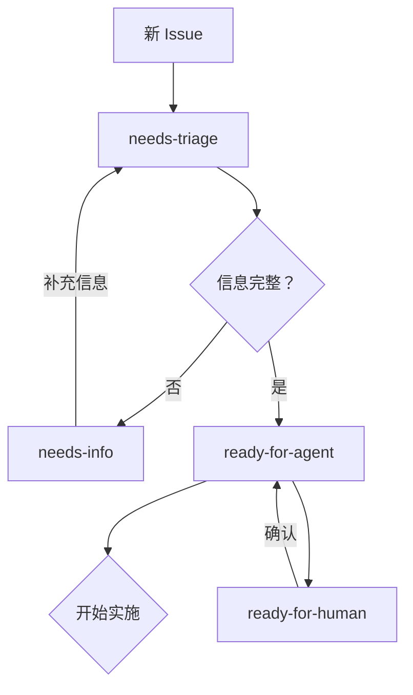

# Triage Label Vocabulary

> **位置**: `docs/agents/triage-labels.md`  
> **用途**: 定义 triage skill 使用的五个标准化标签

---

## 标准化 Triage 标签

`triage` skill 使用以下五个标签来对 issues 进行分类：

| Label | 含义 | 典型场景 |
|-------|------|----------|
| `needs-triage` | 待分类 | 新创建的 issue，尚未经过分类流程 |
| `needs-info` | 需要补充信息 | 问题描述不清晰，需要 reporter 补充细节 |
| `ready-for-agent` | 准备就绪 | 需求明确、规格完整，Agent 可直接开始实施 |
| `ready-for-human` | 待人工审核 | 需要产品负责人或技术负责人确认后才能推进 |
| `wontfix` | 不予修复 | 明确拒绝的需求或重复的 issue |

---

## 标签工作流



---

## 使用方式

### 在 GitHub 上添加标签

```bash
# 添加标签到 issue
gh issue edit <number> --add-label "ready-for-agent"

# 移除标签
gh issue edit <number> --remove-label "needs-triage"

# 查看所有 open issues 及其标签
gh issue list --state open
```

### 自动分类

`triage` skill 会自动根据 issue 内容和描述应用相应的标签：
- 新 issue → `needs-triage`
- 不完整描述 → `needs-info`
- 规格完整 → `ready-for-agent`
- 需要确认 → `ready-for-human`
- 明确拒绝 → `wontfix`

---

## 自定义标签

如需使用自定义标签（而非默认值），请编辑本文件并同步更新 `triage` skill 配置。

---

## 相关文档

- [Issue Tracker](./issue-tracker.md) — Issue tracker 配置
- [Domain Docs](./domain.md) — 如何阅读领域文档
