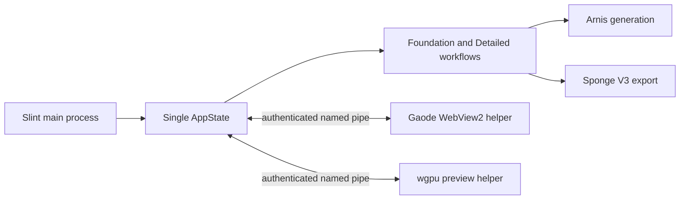

# Native V1 architecture

## Runtime boundaries

| Responsibility | Implementation |
| --- | --- |
| UI and sole application state owner | `native/apps/campus-native` |
| Gaode Web JS API isolation | `native/apps/campus-map` |
| Native 3D preview | `native/apps/campus-preview` |
| Session diagnostics and incident IDs | `native/apps/campus-native/src/diagnostics.rs` |
| Portable projects, autosave, undo/redo | `native/crates/campus-state` |
| OSM and optional Overture queries | `native/crates/campus-services` |
| Arnis appearance rules | `native/crates/arnis-core` |
| Sponge V3 export | `native/crates/campus-export` |
| Helper IPC protocol | `native/crates/campus-tool-protocol` |

The helper processes do not own project state. The former React/Tauri
implementation was removed after native functional-parity acceptance.

The main process records ordinary operation failures, supervised-tool failures,
startup recovery failures, and panics as JSON Lines under the application data
directory. UI errors remain visible until dismissed and include the incident ID
needed to locate the corresponding diagnostic record.
