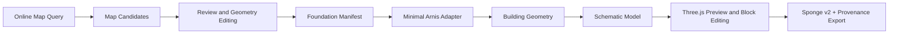

# First Vertical Slice Architecture

## Seams

| Seam | Contract | Main implementation |
| --- | --- | --- |
| Online query | `CandidateProvider` | `src/services/onlineMapQuery.ts` |
| Review | `ReviewedCandidate` to `MapFeature` | `src/services/candidateReview.ts` |
| Mode handoff | `FoundationManifest` and `BuildingSlot` | `src/domain/foundationManifest.ts` |
| Building enrichment | `BuildingGeometryProvider` | `src/adapters/minimalArnisAdapter.ts` |
| Voxel generation | `BuildingGeometry` to `SchematicModel` | `src/services/buildingGeometryToSchematic.ts` |
| Preview/edit/export | `SchematicModel` | `src/components/SchematicPreviewer.tsx`, `src/services/schematicEditing.ts`, `src/services/detailedSchematicExport.ts` |

Each seam has a smoke test that exercises externally visible behavior. `scripts/smoke-first-vertical-slice-completion.mjs` verifies the complete offline path without calling live services.
