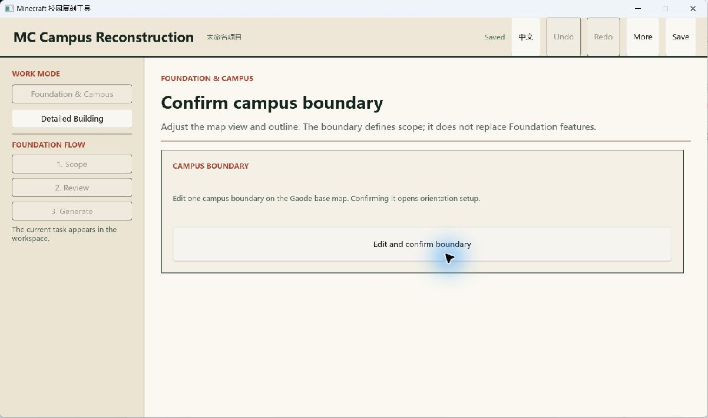
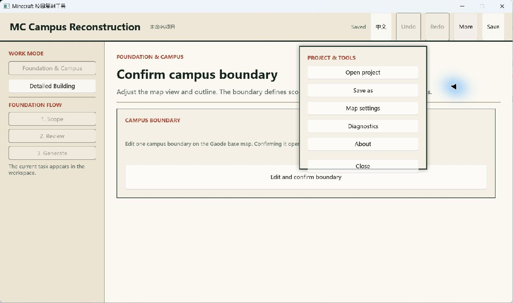
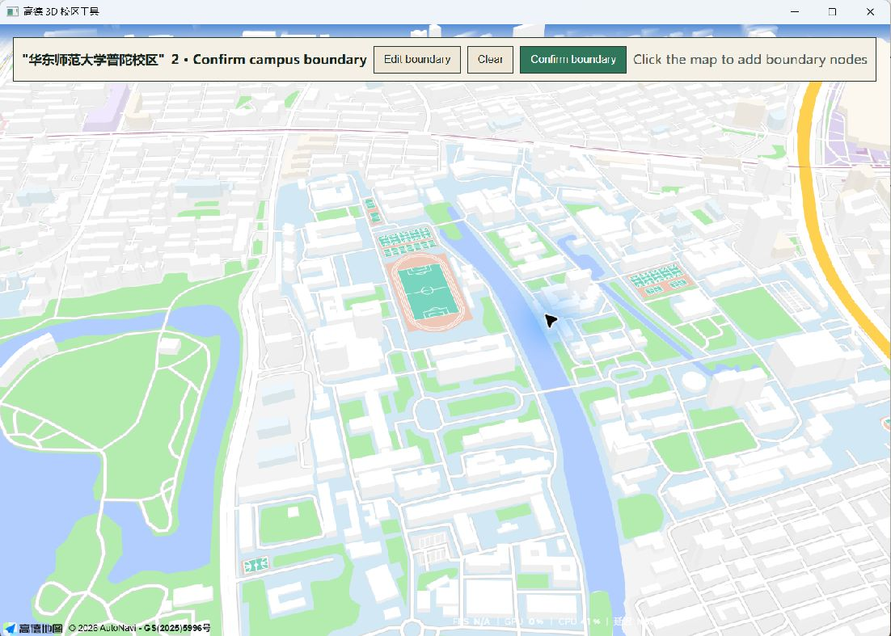
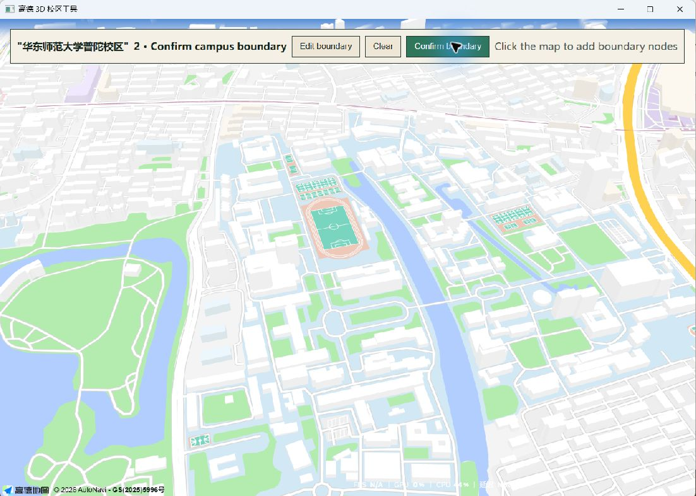
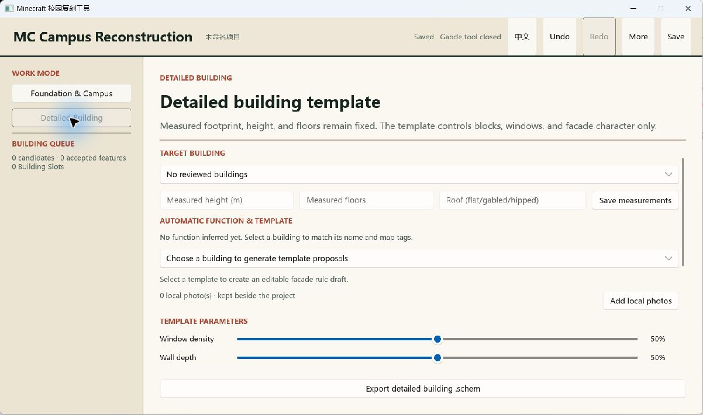
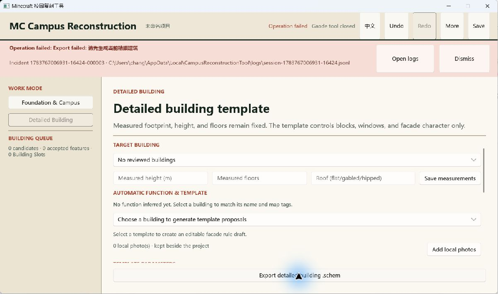

# 核心流程产品审计（2026-07-11）

## 审计范围

从当前源码构建的 Windows 桌面程序出发，检查三个用户目标：创建校园项目、完成地基范围、进入单栋精修。证据只使用本轮重新捕获并人工检查通过的截图。

## 总体结论

当前产品不可作为可交付版本。主要问题不是样式粗糙，而是任务入口、流程状态、错误反馈和空状态都没有形成连续的用户旅程。用户必须理解内部状态，且在多个窗口之间自行推断下一步。

## 步骤与健康度

### 1. 启动并寻找“新建校园项目”——阻断

- 程序启动后直接恢复到“确认校区边界”，项目名却仍是“未命名项目”。用户不知道之前完成了什么，也不知道如何重新开始。
- 中文窗口标题、中文项目名与英文工作区混用，语言状态不可信。
- 左侧 `Scope / Review / Generate` 是内部流程分组，不是用户任务；按钮状态也没有解释原因。

- “更多”菜单包含打开、另存为、地图设置、诊断和关于，但没有“新建项目”。
- 因此无法从当前状态安全开始一次全新的校园复刻；审计不能在不破坏现有本地项目的前提下完成新建流程。
- 地图密钥设置和诊断日志与项目操作混在一个菜单中，频率和风险完全不同。

### 2. 确认校园边界——严重问题

- 地图被拆成独立窗口，主程序没有同步的步骤说明或完成状态；用户需要自行理解“完成后关闭地图返回”。
- 页面进入时实际上已经处于点选状态，但按钮写着 `Edit boundary`，控件文案与真实状态矛盾。
- `Edit boundary`、`Clear`、`Confirm boundary` 同权并列，没有清晰的主动作顺序。
- 当前边界是否存在、已有多少个点、是否满足确认条件均不可见。

- 在零个节点时点击确认，地图窗口没有任何可见反馈。
- 错误被发送到后方主窗口；只有关闭地图后才能看到。这是跨窗口反馈断裂，不是提示文案问题。

### 3. 进入单栋精修——阻断

- 地基没有产生任何建筑候选或 Building Slot，仍然允许进入完整精修表单。
- 页面同时展示建筑选择、测量、用途推断、模板、照片、参数和导出；对于空状态用户，这些控件全部是噪声。
- 页面没有唯一下一步，也没有返回地基并生成建筑候选的动作。
- “照片识别”被降级成一个孤立的 `Add local photos` 按钮，没有照片 → 识别 → 立面规则 → 预览的连续关系。

- 没有目标建筑时，“导出精细建筑”仍呈现为可点击主动作。
- 点击后才显示错误，而且英文界面混入中文错误正文。
- 错误条展示日志路径和事件编号，开发诊断信息压过了用户需要的恢复动作。

## 可访问性风险

- 主窗口的自动化可访问性树只暴露窗口和系统标题栏，没有暴露 Slint 内的按钮、输入框、分组和状态；键盘导航和屏幕阅读器使用存在高风险。
- 地图 WebView 的按钮和输入框能够被辅助技术识别，但主程序与地图窗口之间的状态变化没有统一的焦点或消息传达。
- 大量浅灰禁用文本与米色背景对比度偏低；截图只能确认视觉风险，不能据此宣称符合或不符合完整 WCAG 标准。

## 最高优先级改变

1. 把“新建校园复刻”设为明确入口；恢复项目必须显示项目名、完成进度和继续位置。
2. 主窗口只保留一个当前任务和一个主动作；内部阶段名称不作为主导航。
3. 地图成为当前步骤的一部分，校验、点数、完成状态和恢复动作必须在同一窗口可见。
4. 没有 Building Slot 时，精修模式只显示阻断原因和“去生成建筑候选”，不得显示完整编辑器。
5. 单栋精修重组为：选择建筑 → 添加照片 → 自动识别 → 编辑立面规则 → 预览比较 → 导出。
6. 用户错误只说明发生了什么和如何恢复；事件编号与日志路径收进可展开的诊断详情。

## 证据限制

- 由于当前产品没有“新建项目”，本轮不能在不修改现有用户项目的情况下完整验收新建、边界确认和地基生成。
- 没有可用 Building Slot，因此照片识别、立面规则和精修预览无法从真实入口到达；这本身构成流程阻断证据。
- 截图审计不能替代键盘、屏幕阅读器和缩放测试。
